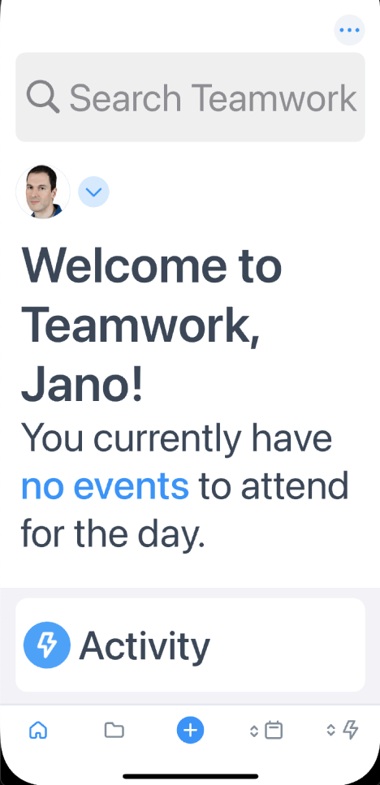
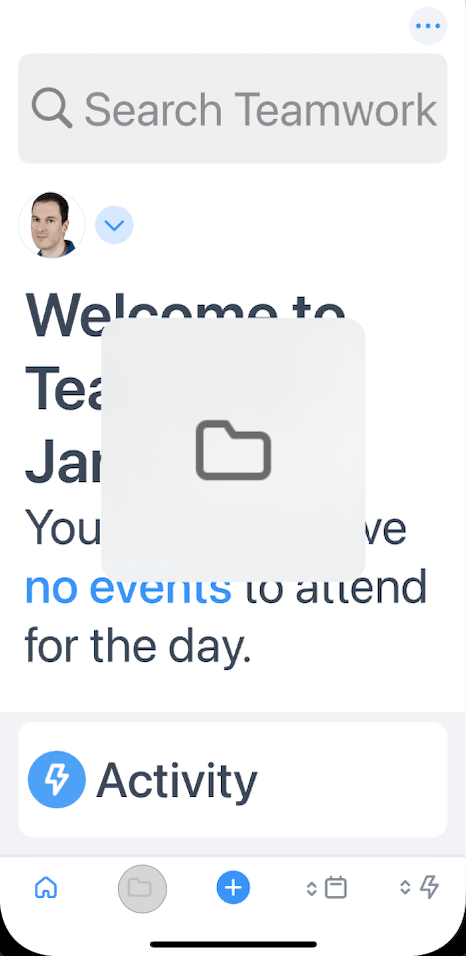
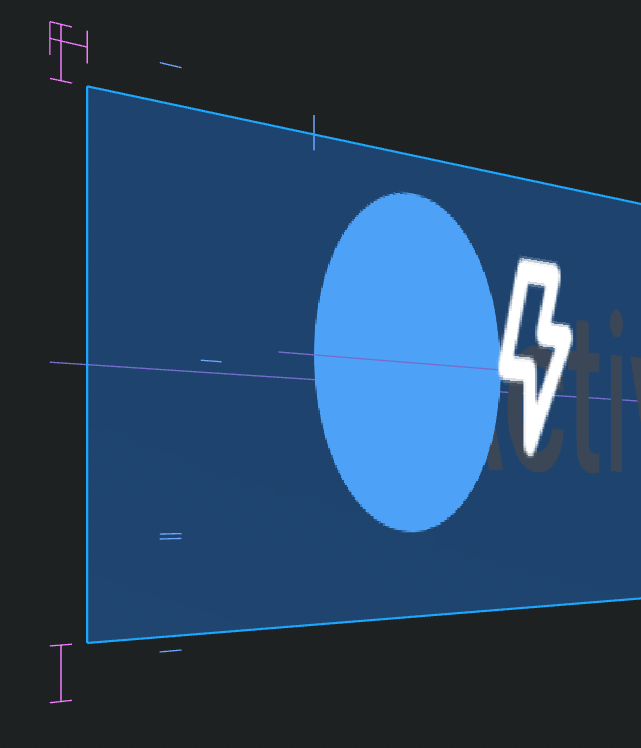
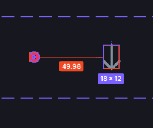
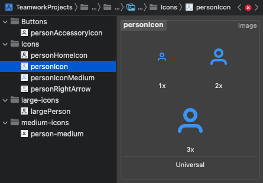
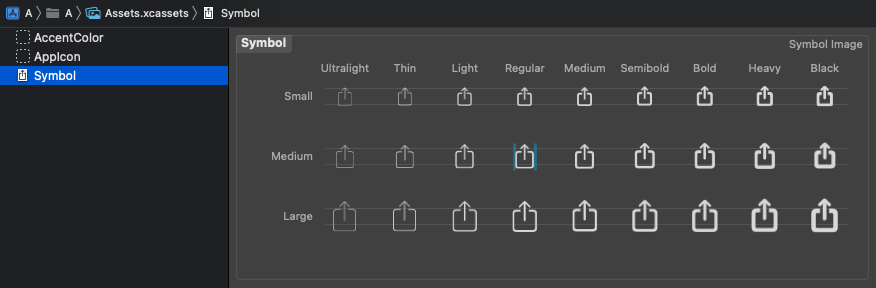
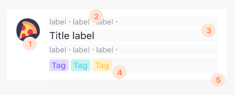
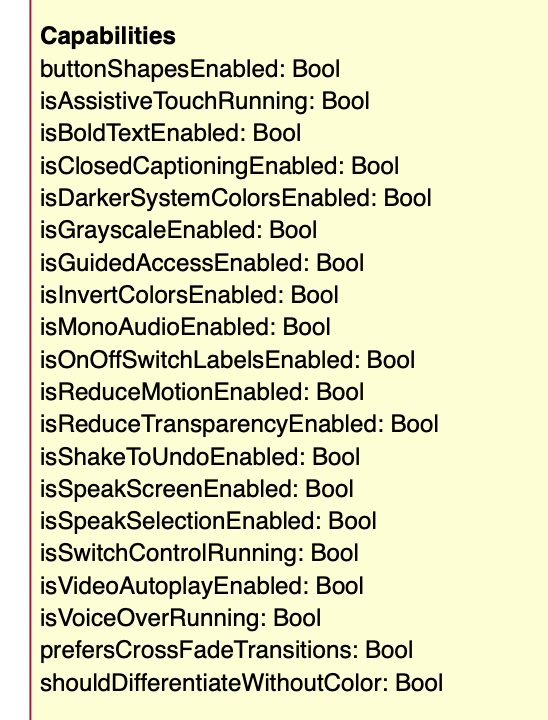

^ Differences are an asset that helps you make better decisions. People are drawn to like-mindedness, consensus, and agreement. It feels comfortable and takes less mental energy, but it doesn’t always produce the best results.

---

# Inclusion 

### means
## providing equal access

^ Inclusion means providing equal access regardless of our differences. When we design with diversity in mind, we make people feel welcome and considered, which also boosts app engagement.

---

### Class, Culture, Ethnicity, Language, Education, Political beliefs, Philosophical beliefs, Religion, Race, Gender, Sexual identity, Age, Abilities, Disabilities, Handedness, Body measurements, Environment, Location, Connectivity, Technology

^ There are many factors that influence our identity: ...
^ One of them is ability, which permanently impacts the experience for a meaningful percentage of the population. 

---

- 23% presbyopia
- 14% have a disability
- 8% men are color blind
- 4% are visually impaired
- [1 in 4 US adults](https://www.cdc.gov/ncbddd/disabilityandhealth/infographic-disability-impacts-all.html#:~:text=61%20million%20adults%20in%20the,is%20highest%20in%20the%20South.) have one disability

^ And we are all affected by situational conditions, like bright sunlight, multitasking on the street, etc.
^ To accommodate all our users we want applications to be easy to use, in a word, accessible.

---

# Accessible 

### means
## usable for everyone

---

# 👆👁👂🧠

^ There are four major areas: motor, vision, hearing, and cognition.
^ Phones are amazing. Today a phone can see, read, speak, remember, and guide you if you are lost.
^ iOS provides many technologies to help our senses or to provide the same information in an alternative way. But actually two main technologies: Dynamic Type and VoiceOver.

---

# Dynamic Type

# VoiceOver

^ Dynamic Type is important because we rely on visual information, and many people use glasses.
^ VoiceOver is important because it adds meta information that can be used by other assistive technologies.

---

---

---

---

# Icons 

- regular padding
- vector images
- [SF Symbols](https://developer.apple.com/design/human-interface-guidelines/sf-symbols/overview/)

---

^ this icon is actually two views, and it doesn’t look sharp when enlarged

---

^ in figma the padding is not regular

---

^  we have many similar icons instead one vector based icon

---

^ the solution is to create a vector-based icon
^ ideally in a SF template. the only mandatory icon here is Regular-M. You can interpolate the others or revisit later. But basically export the template, put the icon in the middle, and export for template v1
^ later SF templates have more capabilities and we can improve them to add colours, opacity and other features

---

## Content flow

^ To support dynamic type we need self sizing views and textual content
^ But if there are images floating in certain positions, then I’m not sure

---

- collection view
- SwiftUI grid
- manual calculation
- different cell
- ignore it

^ There are several ways. It also depends whether there is scroll or not.

---
# Apple text styles

^ Without them we have to scale the existing fonts, match several heading sizes between them, see how it looks. It’s better to start working with Apple styles, and let existing screens be.

---

## Gather information

---

## VoiceOver

- label, hint, traits, frame, value
- group, reorder, hide

---

## Improve Navigation

- magic tap, escape, +/-
- custom actions
- custom rotors

---

## Test

^ The only way to check whther it works is to use it with eyes closed
